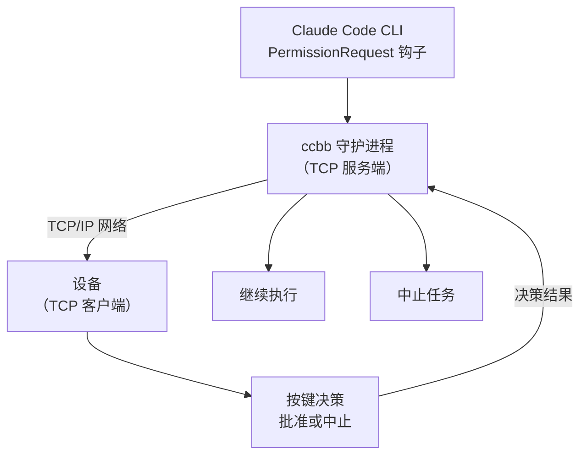
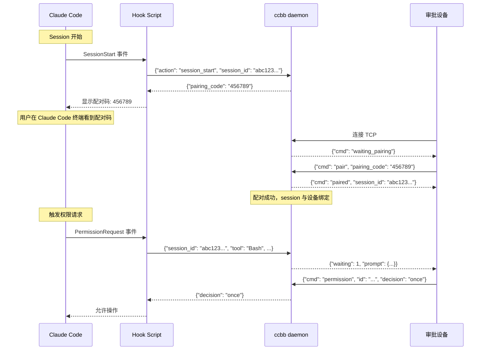

# claude-code-buddy-bridge

> 通过网络协议实现物理审批按钮 — 支持手机、嵌入式设备等任何支持 TCP 的设备

[](https://www.python.org/)
[](LICENSE)
[](https://github.com/astral-sh/uv)

---

Anthropic 的官方 [claude-desktop-buddy](https://github.com/anthropics/claude-desktop-buddy) 固件让设备变成 Claude 的物理审批按钮——但它只支持特定硬件和蓝牙通信。

**claude-code-buddy-bridge** 提供了一个更通用的解决方案：通过标准 TCP 网络协议通信，让任何支持网络的设备（手机、嵌入式设备、单片机等）都可以作为 Claude Code 的物理审批按钮。



---

## 功能

- **零侵入**：通过 Claude Code 原生 Hook 接入，不需要修改任何项目文件
- **Fail-open**：守护进程未运行时，CC 自动回退到自己的权限对话框
- **TCP 网络通信**：使用标准 TCP/IP 协议，跨平台、跨设备兼容
- **多终端多设备配对**：支持多个 Claude Code 终端与多个审批设备配对
- **设备配对机制**：通过 6 位随机配对码建立终端与设备的一一对应关系
- **完整上下文传递**：所有 Claude Code Hook 的原始信息都会传递给设备
- **支持多语言**：不再有中文等非 ASCII 字符的限制
- **并发串行**：多个并发 hook 请求排队，不会同时争抢设备
- **EOF 竞争检测**：若 CC 提前终止 hook 进程，立即清空设备显示，不会傻等超时

---

## 跨平台说明

本项目支持 **Windows、macOS 和 Linux** 系统，所有平台统一使用 TCP 网络通信，无需根据平台区分：

- **Hook → Bridge**：TCP（端口 9876，本地回环）
- **Bridge → 设备**：TCP（端口 9876）

统一使用 TCP 的优势：
- 跨平台兼容性好，代码逻辑一致
- 简化部署和配置
- 同一端口同时支持 Hook 和设备连接

## 支持的设备

任何支持 TCP 客户端的设备都可以使用：

- 📱 **智能手机**：通过 App 或脚本连接
- 🔧 **嵌入式设备**：ESP32、Arduino、Raspberry Pi 等
- 💻 **电脑/服务器**：通过脚本或程序连接
- 🕹️ **单片机**：任何支持网络功能的 MCU

## 配对机制

系统支持多个 Claude Code 终端与多个审批设备配对，通过 6 位配对码建立一一对应关系。配对码基于 session_id 生成，确保同一 session 的所有审批请求都能路由到正确的设备：



**配对流程说明**：

1. **Session 开始**：当 Claude Code 启动新 session 时，SessionStart hook 触发
2. **生成配对码**：Bridge 基于 session_id 生成 6 位配对码，并显示在终端
3. **设备输入配对码**：用户在审批设备上输入配对码并发送配对请求
4. **建立配对关系**：Bridge 验证配对码，将设备与 session 绑定
5. **审批请求**：当 PermissionRequest 触发时，使用 session_id 查找配对的设备
6. **决策响应**：设备的决策响应返回给对应 session 的 Hook

**配对特性**：

- **基于 session_id**：配对码与 session_id 绑定，同一 session 的所有审批请求都能正确路由
- **确定性生成**：相同 session_id 总是生成相同配对码，便于记忆
- **多终端支持**：不同 session 有不同配对码，支持多个 Claude Code 终端同时运行
- **设备绑定**：一个设备配对后只能处理对应 session 的请求

---

## 快速开始

### 1. 安装并注入 Hook

```bash
cd /workspace
uv sync
uv run ccbb install
# 只拦截 Bash 工具（更精准）：
# uv run ccbb install --tools Bash
```

这条命令会自动在 `~/.claude/settings.json` 中写入配置，包括：
- **SessionStart hook**：在 session 开始时显示配对码
- **PermissionRequest hook**：处理审批请求

### 2. 启动守护进程（电脑作为服务端）

在电脑上运行 ccbb daemon：

```bash
uv run ccbb daemon
```

默认监听 `0.0.0.0:9876`，可以通过环境变量自定义：
```bash
CCBB_TCP_HOST=192.168.1.100 CCBB_TCP_PORT=8888 uv run ccbb daemon
```

### 3. 启动 Claude Code

打开 Claude Code，终端会显示类似以下信息：

```
==================================================
  Claude Code Buddy Bridge
  设备配对码: 456789
  请在审批设备上输入此配对码
==================================================
```

### 4. 连接设备（作为 TCP 客户端）

任何支持 TCP 的设备都可以连接。以下是几种连接方式：

#### 方式一：使用示例客户端（测试用）

```bash
python3 examples/tcp_device_client.py
```

如果设备在另一台机器上：
```bash
CCBB_TCP_HOST=192.168.1.100 CCBB_TCP_PORT=8888 python3 examples/tcp_device_client.py
```

在客户端输入终端显示的配对码（如 `456789`）完成配对。

#### 方式二：使用手机 App

编写一个简单的 TCP 客户端 App，连接到电脑的 IP 和端口。

#### 方式三：使用嵌入式设备

```cpp
// ESP32 示例代码
#include <WiFi.h>
#include <WiFiClient.h>

const char* ssid = "your_wifi_ssid";
const char* password = "your_wifi_password";
const char* host = "192.168.1.100";
const int port = 9876;

WiFiClient client;

void setup() {
  WiFi.begin(ssid, password);
  while (WiFi.status() != WL_CONNECTED) { delay(500); }
  
  if (client.connect(host, port)) {
    // 先配对
    client.println("{\"cmd\": \"pair\", \"pairing_code\": \"456789\"}");
    // 等待配对成功后，可以发送审批决策
    // client.println("{\"cmd\": \"permission\", \"id\": \"...\", \"decision\": \"once\"}");
  }
}
```

### 5. 使用

当 Claude Code 需要审批时：

- **在设备上发送批准指令** → 批准（`allow`）
- **在设备上发送拒绝指令** → 拒绝（`deny`）

设备不在线？ccbb 超时后自动 fail-open，CC 弹出自己的对话框。

---

## 常用命令

| 命令 | 说明 |
|------|------|
| `ccbb install` | 注入 hook 到 Claude Code 配置 |
| `ccbb install --tools Bash Write` | 只拦截指定工具 |
| `ccbb daemon` | 启动守护进程（TCP 服务端） |
| `ccbb daemon -v` | 调试模式（显示详细日志） |
| `ccbb status` | 检查守护进程是否在线 |
| `ccbb uninstall` | 移除 hook 配置 |

---

## 环境变量

| 变量 | 说明 |
|------|------|
| `CCBB_TCP_HOST` | TCP 服务端监听地址（默认 0.0.0.0） |
| `CCBB_TCP_PORT` | TCP 服务端监听端口（默认 9876） |

---

## TCP 协议说明

守护进程作为 TCP 服务端，Hook 和设备都作为客户端连接。双方通过 JSON 行协议通信（每条消息以换行符 `\n` 结尾）。

### 连接识别

Bridge 通过第一条消息自动识别连接类型：

| 消息特征 | 连接类型 |
|---------|---------|
| 包含 `"action": "session_start"` 或 `"session_id"` 字段 | Hook 连接（Claude Code） |
| 包含 `"cmd": "pair"` 或 `"cmd": "permission"` | 设备连接 |

### 从 Hook 到服务端

**SessionStart 事件**：
```json
{
  "action": "session_start",
  "session_id": "abc123def456..."
}
```

**响应**：
```json
{"pairing_code": "456789"}
```

**PermissionRequest 事件**：
```json
{
  "session_id": "abc123def456...",
  "id": "req_12345",
  "tool": "Bash",
  "hint": "ls -la",
  "context": {...}
}
```

**响应**：
```json
{"decision": "once"}  // 或 "deny"、"timeout"
```

### 从服务端到设备

**等待配对**（设备刚连接时）：
```json
{"cmd": "waiting_pairing", "message": "请输入配对码"}
```

**配对成功**：
```json
{"cmd": "paired", "pairing_code": "456789", "session_id": "abc123..."}
```

**配对失败**：
```json
{"cmd": "pairing_failed", "reason": "配对码无效或已过期"}
```

**快照（审批请求）**：
```json
{
  "total": 1,
  "running": 0,
  "waiting": 1,
  "msg": "approve: Bash",
  "entries": ["10:30 Bash: ls -la"],
  "tokens": 0,
  "tokens_today": 0,
  "prompt": {
    "id": "req_12345",
    "tool": "Bash",
    "hint": "ls -la"
  },
  "context": {...}
}
```

**确认响应**（收到审批决策后）：
```json
{"ack": "permission", "ok": true, "n": 0}
```

### 从设备到服务端

**配对请求**：
```json
{
  "cmd": "pair",
  "pairing_code": "456789"
}
```

**审批决策**（必须已配对）：
```json
{
  "cmd": "permission",
  "id": "req_12345",
  "decision": "once"
}
```

决策值：
- `once`：批准
- `deny`：拒绝

---

## 设备开发指南

### 基本流程

1. **连接到 TCP 服务端**：连接到电脑的 IP 和端口
2. **接收等待配对消息**：服务端发送 `{"cmd": "waiting_pairing"}`
3. **输入配对码**：用户在设备上输入 Claude Code 终端显示的 6 位配对码
4. **发送配对请求**：发送 `{"cmd": "pair", "pairing_code": "456789"}`
5. **等待配对成功**：服务端返回 `{"cmd": "paired", "session_id": "abc123..."}`
6. **接收审批请求**：当有待审批请求时，服务端发送快照消息
7. **发送决策**：用户操作后，发送包含 `cmd`、`id` 和 `decision` 的 JSON

### 最小实现示例（包含配对）

```python
import socket
import json

# 连接到服务端
s = socket.socket(socket.AF_INET, socket.SOCK_STREAM)
s.connect(("192.168.1.100", 9876))

paired = False
rx_buf = bytearray()

while True:
    data = s.recv(1024)
    if not data:
        break
    rx_buf.extend(data)
    
    # 处理所有完整的 JSON 消息
    while b"\n" in rx_buf:
        nl = rx_buf.find(b"\n")
        line = bytes(rx_buf[:nl])
        del rx_buf[:nl + 1]
        
        try:
            msg = json.loads(line.decode("utf-8"))
        except:
            continue
        
        cmd = msg.get("cmd")
        
        if cmd == "waiting_pairing":
            # 未配对，等待用户输入配对码
            pairing_code = input("请输入配对码: ").strip()
            if len(pairing_code) == 6 and pairing_code.isdigit():
                s.sendall(json.dumps({
                    "cmd": "pair",
                    "pairing_code": pairing_code
                }).encode() + b"\n")
        elif cmd == "paired":
            # 配对成功
            paired = True
            print(f"配对成功! 配对码: {msg.get('pairing_code')}")
            print("等待审批请求...")
        elif cmd == "pairing_failed":
            # 配对失败
            print(f"配对失败: {msg.get('reason', '未知原因')}")
        elif cmd == "unpaired":
            # 配对解除
            paired = False
            print("配对已解除，请重新配对")
        elif msg.get("waiting", 0) > 0 and paired:
            # 收到审批请求
            prompt = msg["prompt"]
            print(f"\n审批请求:")
            print(f"  工具: {prompt['tool']}")
            print(f"  提示: {prompt['hint']}")
            
            # 模拟用户输入
            decision = input("批准(a)或拒绝(d)? ").strip().lower()
            if decision == "a":
                s.sendall(json.dumps({
                    "cmd": "permission",
                    "id": prompt["id"],
                    "decision": "once"
                }).encode() + b"\n")
            elif decision == "d":
                s.sendall(json.dumps({
                    "cmd": "permission",
                    "id": prompt["id"],
                    "decision": "deny"
                }).encode() + b"\n")

s.close()
```

---

## macOS 开机自启（launchd）

```bash
# 先确认 ccbb 安装路径
which ccbb

# 编辑 plist，将路径替换为上一步的输出
cp extras/dev.ccbb.daemon.plist ~/Library/LaunchAgents/
# 编辑文件，修改 ProgramArguments 中的路径

launchctl load ~/Library/LaunchAgents/dev.ccbb.daemon.plist
```

卸载：

```bash
launchctl unload ~/Library/LaunchAgents/dev.ccbb.daemon.plist
rm ~/Library/LaunchAgents/dev.ccbb.daemon.plist
```

---

## 开发

```bash
git clone https://github.com/oh-myfun/claude-code-buddy-bridge
cd claude-code-buddy-bridge
uv sync --extra dev

# 运行测试
uv run pytest

# 直接运行
uv run ccbb daemon -v
```

### 项目结构

```
ccbb/
├── src/ccbb/
│   ├── __init__.py     版本号
│   ├── bridge.py       守护进程核心（TCP 服务端 + Unix Socket 服务器）
│   ├── hook.py         被 Claude Code 调用的 hook 脚本
│   └── cli.py          命令行入口（daemon / install / status）
├── examples/
│   └── tcp_device_client.py   TCP 设备客户端示例
├── extras/
│   └── dev.ccbb.daemon.plist   macOS launchd 配置模板
├── pyproject.toml
└── README.md
```

---

## 致谢

协议格式参考了 Anthropic 的 [claude-desktop-buddy](https://github.com/anthropics/claude-desktop-buddy)。

核心架构设计参考了 [CharmYue/cc-buddy-bridge](https://github.com/CharmYue/cc-buddy-bridge) 和 [cuiqingwei/claude-desktop-buddy-bridge](https://github.com/cuiqingwei/claude-desktop-buddy-bridge)——尤其是 EOF 竞争检测、permission_lock 串行化和 fail-open 设计。

---

## License

[MIT](LICENSE)
