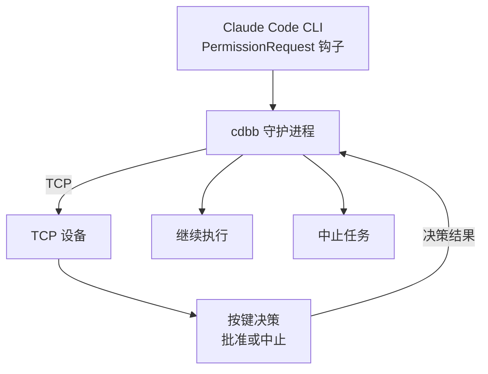

# claude-desktop-buddy-bridge

> 用一个设备作为 Claude Code CLI 的物理审批按钮 — 通过 TCP 通信

[](https://www.python.org/)
[](LICENSE)
[](https://github.com/astral-sh/uv)

---

Anthropic 的官方 claude-desktop-buddy 固件让设备变成 Claude 的物理审批按钮——但它只与桌面应用通信，CLI 用户无缘使用。

**claude-desktop-buddy-bridge** 填补这个空缺：一个轻量 Python 守护进程，通过 Claude Code 原生 Hook 系统拦截工具调用，经由 TCP 与设备通信，让你用手边的设备来 approve / deny，而不是盯着终端敲 y。



---

## 功能

- **零侵入**：通过 Claude Code 原生 Hook 接入，不需要修改任何项目文件
- **Fail-open**：守护进程未运行时，CC 自动回退到自己的权限对话框
- **TCP 通信**：使用标准 TCP 协议，支持远程设备或本地模拟
- **中文安全**：所有发往设备的字符串自动 sanitize，避免特殊字符问题
- **并发串行**：多个并发 hook 请求排队，不会同时争抢设备
- **EOF 竞争检测**：若 CC 提前终止 hook 进程，立即清空设备显示，不会傻等超时
- **心跳自愈**：TCP 链路断开后连续失败退出，由 launchd/systemd 自动重启

---

## 快速开始

### 1. 准备 TCP 设备

首先需要一个 TCP 设备（可以是真实硬件，也可以使用我们提供的示例服务器模拟）：

```bash
# 使用示例服务器模拟设备
python3 examples/tcp_device_server.py
```

### 2. 安装 claude-desktop-buddy-bridge

```bash
# 使用 uv（推荐）
uv tool install claude-desktop-buddy-bridge

# 或直接从源码
git clone <repository-url>
cd claude-desktop-buddy-bridge
uv sync
```

### 3. 注入 Claude Code Hook

```bash
source .venv/bin/activate 
cdbb install
# 只拦截 Bash 工具（更精准）：
# cdbb install --tools Bash
```

这条命令会自动在 `~/.claude/settings.json` 中写入配置。

### 4. 启动守护进程

首先确保 TCP 设备服务器正在运行，然后：

```bash
cdbb daemon
```

如果需要自定义 TCP 地址：

```bash
# 使用环境变量指定地址
CDBB_TCP_HOST=192.168.1.100 CDBB_TCP_PORT=8888 cdbb daemon
```

### 5. 使用

打开 Claude Code，触发一个需要审批的操作（如执行 Bash 命令）：

- **在示例设备中输入 `A`** → 批准（`allow`）
- **在示例设备中输入 `D`** → 拒绝（`deny`）

设备不在手边？cdbb 超时后自动 fail-open，CC 弹出自己的对话框。

---

## 常用命令

| 命令 | 说明 |
|------|------|
| `cdbb install` | 注入 hook 到 Claude Code 配置 |
| `cdbb install --tools Bash Write` | 只拦截指定工具 |
| `cdbb daemon` | 启动守护进程 |
| `cdbb daemon -v` | 调试模式（显示详细日志） |
| `cdbb status` | 检查守护进程是否在线 |
| `cdbb uninstall` | 移除 hook 配置 |

---

## 环境变量

| 变量 | 说明 |
|------|------|
| `CDBB_TCP_HOST` | TCP 设备服务器地址（默认 127.0.0.1） |
| `CDBB_TCP_PORT` | TCP 设备服务器端口（默认 9876） |

---

## TCP 协议说明

守护进程作为 TCP 客户端，连接到设备服务器。双方通过 JSON 行协议通信。

### 从守护进程到设备

**时间同步**：
```json
{"time": [1234567890, 28800]}
```

**快照（状态更新）**：
```json
{
  "total": 1,
  "running": 0,
  "waiting": 1,
  "msg": "approve: Bash",
  "entries": ["10:30 Bash: ls -la"],
  "tokens": 0,
  "tokens_today": 0,
  "prompt": {
    "id": "req_12345",
    "tool": "Bash",
    "hint": "ls -la"
  }
}
```

### 从设备到守护进程

**审批决策**：
```json
{
  "cmd": "permission",
  "id": "req_12345",
  "decision": "once"
}
```

决策值可以是：
- `once`：批准
- `deny`：拒绝

**确认响应**（从守护进程到设备）：
```json
{"ack": "permission", "ok": true, "n": 0}
```

---

## macOS 开机自启（launchd）

```bash
# 先确认 cdbb 安装路径
which cdbb

# 编辑 plist，将路径替换为上一步的输出
cp extras/dev.cdbb.daemon.plist ~/Library/LaunchAgents/
# 编辑文件，修改 ProgramArguments 中的路径

launchctl load ~/Library/LaunchAgents/dev.cdbb.daemon.plist
```

卸载：
```bash
launchctl unload ~/Library/LaunchAgents/dev.cdbb.daemon.plist
rm ~/Library/LaunchAgents/dev.cdbb.daemon.plist
```

---

## 开发

```bash
git clone <repository-url>
cd claude-desktop-buddy-bridge
uv sync --extra dev

# 运行测试
uv run pytest

# 直接运行
uv run cdbb daemon -v
```

---

## 致谢

原 BLE 版本的架构设计参考了 CharmYue/cc-buddy-bridge。

---

## License

[MIT](LICENSE)
