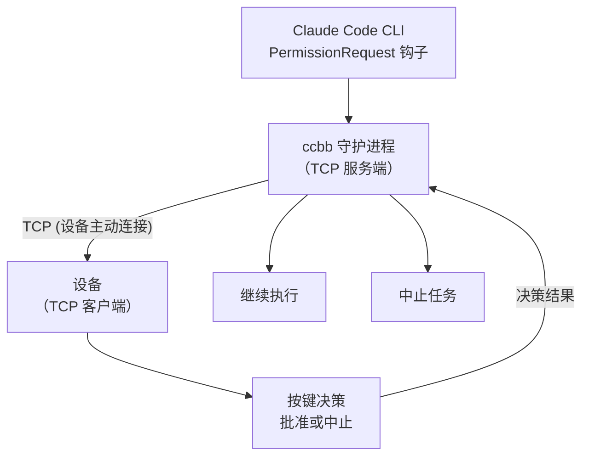

# claude-code-buddy-bridge

> 用一个设备作为 Claude Code CLI 的物理审批按钮 — 电脑作为 TCP 服务端，设备作为客户端连接

[](https://www.python.org/)
[](LICENSE)

---

Anthropic 的官方 claude-desktop-buddy 固件让设备变成 Claude 的物理审批按钮——但它只与桌面应用通信，CLI 用户无缘使用。

**claude-code-buddy-bridge** 填补这个空缺：一个轻量 Python 守护进程，通过 Claude Code 原生 Hook 系统拦截工具调用。电脑作为 TCP 服务端监听，设备作为 TCP 客户端连接，让你用手边的设备来 approve / deny，而不是盯着终端敲 y。



---

## 功能

- **零侵入**：通过 Claude Code 原生 Hook 接入，不需要修改任何项目文件
- **Fail-open**：守护进程未运行时，CC 自动回退到自己的权限对话框
- **TCP 服务端模式**：电脑作为服务端监听，设备作为客户端连接，更灵活的网络拓扑
- **支持多设备连接**：多个设备可以同时连接并接收审批请求
- **中文安全**：所有发往设备的字符串自动 sanitize，避免特殊字符问题
- **并发串行**：多个并发 hook 请求排队，不会同时争抢设备
- **EOF 竞争检测**：若 CC 提前终止 hook 进程，立即清空设备显示，不会傻等超时

---

## 快速开始

### 1. 启动守护进程（电脑作为服务端）

首先在电脑上运行 ccbb daemon：

```bash
cd /workspace
uv sync
uv run ccbb daemon
```

默认监听 `0.0.0.0:9876`，可以通过环境变量自定义：
```bash
CCBB_TCP_HOST=192.168.1.100 CCBB_TCP_PORT=8888 uv run ccbb daemon
```

### 2. 启动示例设备客户端

在另一个终端运行（可以在同一台机器或另一台设备上）：

```bash
python3 examples/tcp_device_client.py
```

如果设备在另一台机器上：
```bash
CCBB_TCP_HOST=192.168.1.100 CCBB_TCP_PORT=8888 python3 examples/tcp_device_client.py
```

### 3. 注入 Claude Code Hook

```bash
uv run ccbb install
# 只拦截 Bash 工具（更精准）：
# uv run ccbb install --tools Bash
```

这条命令会自动在 `~/.claude/settings.json` 中写入配置。

### 4. 使用

打开 Claude Code，触发一个需要审批的操作（如执行 Bash 命令）：

- **在示例设备中输入 `A`** → 批准（`allow`）
- **在示例设备中输入 `D`** → 拒绝（`deny`）

设备不在线？ccbb 超时后自动 fail-open，CC 弹出自己的对话框。

---

## 常用命令

| 命令 | 说明 |
|------|------|
| `ccbb install` | 注入 hook 到 Claude Code 配置 |
| `ccbb install --tools Bash Write` | 只拦截指定工具 |
| `ccbb daemon` | 启动守护进程（TCP 服务端） |
| `ccbb daemon -v` | 调试模式（显示详细日志） |
| `ccbb status` | 检查守护进程是否在线 |
| `ccbb uninstall` | 移除 hook 配置 |

---

## 环境变量

| 变量 | 说明 |
|------|------|
| `CCBB_TCP_HOST` | TCP 服务端监听地址（默认 0.0.0.0） |
| `CCBB_TCP_PORT` | TCP 服务端监听端口（默认 9876） |

---

## TCP 协议说明

守护进程作为 TCP 服务端，设备作为客户端连接。双方通过 JSON 行协议通信。

### 从服务端到设备

**时间同步**：
```json
{"time": [1234567890, 28800]}
```

**快照（状态更新）**：
```json
{
  "total": 1,
  "running": 0,
  "waiting": 1,
  "msg": "approve: Bash",
  "entries": ["10:30 Bash: ls -la"],
  "tokens": 0,
  "tokens_today": 0,
  "prompt": {
    "id": "req_12345",
    "tool": "Bash",
    "hint": "ls -la"
  }
}
```

### 从设备到服务端

**审批决策**：
```json
{
  "cmd": "permission",
  "id": "req_12345",
  "decision": "once"
}
```

决策值可以是：
- `once`：批准
- `deny`：拒绝

**确认响应**（从服务端到设备）：
```json
{"ack": "permission", "ok": true, "n": 0}
```

---

## macOS 开机自启（launchd）

参考 `extras/` 目录下的示例 plist 文件，修改后放到 `~/Library/LaunchAgents/` 目录。

---

## 开发

```bash
git clone <repository-url>
cd claude-code-buddy-bridge
uv sync --extra dev

# 运行测试
uv run pytest

# 直接运行
uv run ccbb daemon -v
```

---

## 致谢

原项目架构设计参考了 CharmYue/cc-buddy-bridge 和 cuiqingwei/claude-desktop-buddy-bridge。

---

## License

[MIT](LICENSE)
