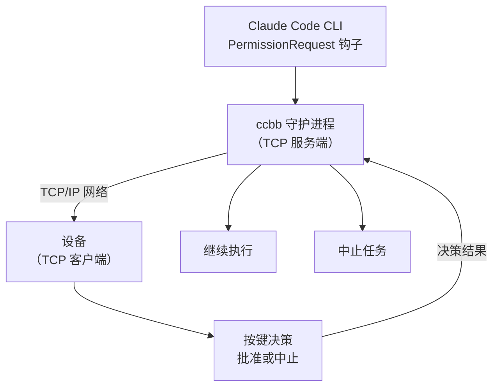

# claude-code-buddy-bridge

> 通过网络协议实现物理审批按钮 — 支持手机、嵌入式设备等任何支持 TCP 的设备

[](https://www.python.org/)
[](LICENSE)
[](https://github.com/astral-sh/uv)

---

Anthropic 的官方 [claude-desktop-buddy](https://github.com/anthropics/claude-desktop-buddy) 固件让设备变成 Claude 的物理审批按钮——但它只支持特定硬件和蓝牙通信。

**claude-code-buddy-bridge** 提供了一个更通用的解决方案：通过标准 TCP 网络协议通信，让任何支持网络的设备（手机、嵌入式设备、单片机等）都可以作为 Claude Code 的物理审批按钮。



---

## 功能

- **零侵入**：通过 Claude Code 原生 Hook 接入，不需要修改任何项目文件
- **Fail-open**：守护进程未运行时，CC 自动回退到自己的权限对话框
- **TCP 网络通信**：使用标准 TCP/IP 协议，跨平台、跨设备兼容
- **多设备支持**：手机、嵌入式设备、单片机等任何支持 TCP 的设备均可连接
- **支持多设备同时连接**：多个设备可以同时连接并接收审批请求
- **中文安全**：所有发往设备的字符串自动 sanitize，避免特殊字符问题
- **并发串行**：多个并发 hook 请求排队，不会同时争抢设备
- **EOF 竞争检测**：若 CC 提前终止 hook 进程，立即清空设备显示，不会傻等超时

---

## 支持的设备

任何支持 TCP 客户端的设备都可以使用：

- 📱 **智能手机**：通过 App 或脚本连接
- 🔧 **嵌入式设备**：ESP32、Arduino、Raspberry Pi 等
- 💻 **电脑/服务器**：通过脚本或程序连接
- 🕹️ **单片机**：任何支持网络功能的 MCU

---

## 快速开始

### 1. 启动守护进程（电脑作为服务端）

首先在电脑上运行 ccbb daemon：

```bash
cd /workspace
uv sync
uv run ccbb daemon
```

默认监听 `0.0.0.0:9876`，可以通过环境变量自定义：
```bash
CCBB_TCP_HOST=192.168.1.100 CCBB_TCP_PORT=8888 uv run ccbb daemon
```

### 2. 连接设备（作为 TCP 客户端）

任何支持 TCP 的设备都可以连接。以下是几种连接方式：

#### 方式一：使用示例客户端（测试用）

```bash
python3 examples/tcp_device_client.py
```

如果设备在另一台机器上：
```bash
CCBB_TCP_HOST=192.168.1.100 CCBB_TCP_PORT=8888 python3 examples/tcp_device_client.py
```

#### 方式二：使用手机 App

编写一个简单的 TCP 客户端 App，连接到电脑的 IP 和端口。

#### 方式三：使用嵌入式设备

```cpp
// ESP32 示例代码
#include <WiFi.h>
#include <WiFiClient.h>

const char* ssid = "your_wifi_ssid";
const char* password = "your_wifi_password";
const char* host = "192.168.1.100";
const int port = 9876;

WiFiClient client;

void setup() {
  WiFi.begin(ssid, password);
  while (WiFi.status() != WL_CONNECTED) { delay(500); }
  
  if (client.connect(host, port)) {
    client.println("{\"cmd\": \"permission\", \"id\": \"test\", \"decision\": \"once\"}");
  }
}
```

### 3. 注入 Claude Code Hook

```bash
uv run ccbb install
# 只拦截 Bash 工具（更精准）：
# uv run ccbb install --tools Bash
```

这条命令会自动在 `~/.claude/settings.json` 中写入配置。

### 4. 使用

打开 Claude Code，触发一个需要审批的操作（如执行 Bash 命令）：

- **在设备上发送批准指令** → 批准（`allow`）
- **在设备上发送拒绝指令** → 拒绝（`deny`）

设备不在线？ccbb 超时后自动 fail-open，CC 弹出自己的对话框。

---

## 常用命令

| 命令 | 说明 |
|------|------|
| `ccbb install` | 注入 hook 到 Claude Code 配置 |
| `ccbb install --tools Bash Write` | 只拦截指定工具 |
| `ccbb daemon` | 启动守护进程（TCP 服务端） |
| `ccbb daemon -v` | 调试模式（显示详细日志） |
| `ccbb status` | 检查守护进程是否在线 |
| `ccbb uninstall` | 移除 hook 配置 |

---

## 环境变量

| 变量 | 说明 |
|------|------|
| `CCBB_TCP_HOST` | TCP 服务端监听地址（默认 0.0.0.0） |
| `CCBB_TCP_PORT` | TCP 服务端监听端口（默认 9876） |

---

## TCP 协议说明

守护进程作为 TCP 服务端，设备作为客户端连接。双方通过 JSON 行协议通信。

### 从服务端到设备

**时间同步**：
```json
{"time": [1234567890, 28800]}
```

**快照（状态更新）**：
```json
{
  "total": 1,
  "running": 0,
  "waiting": 1,
  "msg": "approve: Bash",
  "entries": ["10:30 Bash: ls -la"],
  "tokens": 0,
  "tokens_today": 0,
  "prompt": {
    "id": "req_12345",
    "tool": "Bash",
    "hint": "ls -la"
  }
}
```

### 从设备到服务端

**审批决策**：
```json
{
  "cmd": "permission",
  "id": "req_12345",
  "decision": "once"
}
```

决策值可以是：
- `once`：批准
- `deny`：拒绝

**确认响应**（从服务端到设备）：
```json
{"ack": "permission", "ok": true, "n": 0}
```

---

## 设备开发指南

### 基本流程

1. **连接到 TCP 服务端**：连接到电脑的 IP 和端口
2. **接收快照消息**：解析 JSON 格式的状态更新
3. **显示审批请求**：当 `waiting > 0` 时，显示 `prompt` 中的信息
4. **发送决策**：用户操作后，发送包含 `cmd`、`id` 和 `decision` 的 JSON

### 最小实现示例

```python
import socket
import json

# 连接到服务端
s = socket.socket(socket.AF_INET, socket.SOCK_STREAM)
s.connect(("192.168.1.100", 9876))

# 接收消息
while True:
    data = s.recv(1024)
    if not data:
        break
    msg = json.loads(data.decode())
    
    # 检查是否有待审批请求
    if msg.get("waiting", 0) > 0:
        prompt = msg["prompt"]
        print(f"审批请求: {prompt['tool']} - {prompt['hint']}")
        
        # 模拟用户输入
        decision = input("批准(a)或拒绝(d)? ").strip().lower()
        if decision == "a":
            s.sendall(json.dumps({
                "cmd": "permission",
                "id": prompt["id"],
                "decision": "once"
            }).encode() + b"\n")
        elif decision == "d":
            s.sendall(json.dumps({
                "cmd": "permission",
                "id": prompt["id"],
                "decision": "deny"
            }).encode() + b"\n")

s.close()
```

---

## macOS 开机自启（launchd）

```bash
# 先确认 ccbb 安装路径
which ccbb

# 编辑 plist，将路径替换为上一步的输出
cp extras/dev.ccbb.daemon.plist ~/Library/LaunchAgents/
# 编辑文件，修改 ProgramArguments 中的路径

launchctl load ~/Library/LaunchAgents/dev.ccbb.daemon.plist
```

卸载：

```bash
launchctl unload ~/Library/LaunchAgents/dev.ccbb.daemon.plist
rm ~/Library/LaunchAgents/dev.ccbb.daemon.plist
```

---

## 开发

```bash
git clone https://github.com/oh-myfun/claude-code-buddy-bridge
cd claude-code-buddy-bridge
uv sync --extra dev

# 运行测试
uv run pytest

# 直接运行
uv run ccbb daemon -v
```

### 项目结构

```
ccbb/
├── src/ccbb/
│   ├── __init__.py     版本号
│   ├── bridge.py       守护进程核心（TCP 服务端 + Unix Socket 服务器）
│   ├── hook.py         被 Claude Code 调用的 hook 脚本
│   └── cli.py          命令行入口（daemon / install / status）
├── examples/
│   └── tcp_device_client.py   TCP 设备客户端示例
├── extras/
│   └── dev.ccbb.daemon.plist   macOS launchd 配置模板
├── pyproject.toml
└── README.md
```

---

## 致谢

协议格式参考了 Anthropic 的 [claude-desktop-buddy](https://github.com/anthropics/claude-desktop-buddy)。

核心架构设计参考了 [CharmYue/cc-buddy-bridge](https://github.com/CharmYue/cc-buddy-bridge) 和 [cuiqingwei/claude-desktop-buddy-bridge](https://github.com/cuiqingwei/claude-desktop-buddy-bridge)——尤其是 EOF 竞争检测、permission_lock 串行化和 fail-open 设计。

---

## License

[MIT](LICENSE)
