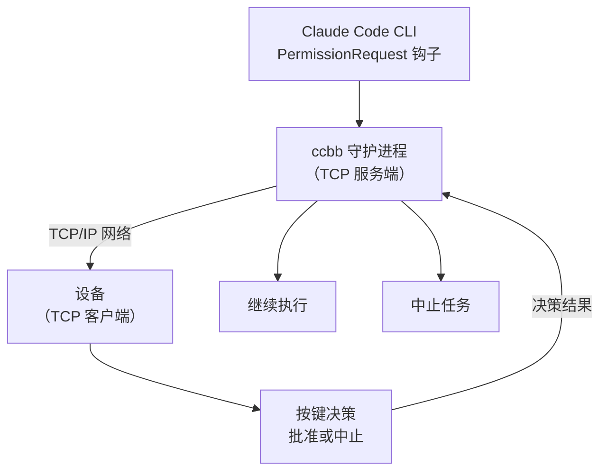

# claude-code-buddy-bridge

> 通过网络协议实现物理审批按钮 — 支持手机、嵌入式设备等任何支持 TCP 的设备

[](https://www.python.org/)
[](LICENSE)
[](https://github.com/astral-sh/uv)

---

Anthropic 的官方 [claude-desktop-buddy](https://github.com/anthropics/claude-desktop-buddy) 固件让设备变成 Claude 的物理审批按钮——但它只支持特定硬件和蓝牙通信。

**claude-code-buddy-bridge**（CLI: `ccbb`）提供了一个更通用的解决方案：通过标准 TCP 网络协议通信，让任何支持网络的设备（手机、嵌入式设备、单片机等）都可以作为 Claude Code 的物理审批按钮。



---

## 功能

- **零侵入**：通过 Claude Code 原生 Hook 接入，不需要修改任何项目文件
- **Fail-open**：守护进程未运行时，CC 自动回退到自己的权限对话框
- **TCP 网络通信**：使用标准 TCP/IP 协议，跨平台、跨设备兼容
- **多终端多设备配对**：支持多个 Claude Code 终端与多个审批设备配对
- **设备配对机制**：通过 8 位配对码建立终端与设备的一一对应关系
- **完整上下文传递**：所有 Claude Code Hook 的原始信息都会传递给设备
- **并发串行**：多个并发 hook 请求排队，不会同时争抢设备
- **EOF 竞争检测**：若 CC 提前终止 hook 进程，立即清空设备显示，不会傻等超时

---

## 快速开始

### 1. 安装并注入 Hook

```bash
uv sync
uv run ccbb install
# 只拦截指定工具：
# uv run ccbb install --tools Bash Write
```

这条命令会自动在 `~/.claude/settings.json` 中写入 Hook 配置。

### 2. 启动守护进程

```bash
uv run ccbb daemon
```

默认监听 `0.0.0.0:9876`，可以通过环境变量自定义：

```bash
CCBB_TCP_HOST=192.168.1.100 CCBB_TCP_PORT=8888 uv run ccbb daemon
```

### 3. 启动 Claude Code

打开 Claude Code，终端会显示配对码：

```
==================================================
  Claude Code Buddy Bridge
  设备配对码: AABB1122
  请在审批设备上输入此配对码
==================================================
```

### 4. 连接设备

参考 `examples/` 目录中的示例客户端和设备端代码：

- `examples/tcp_device_client.py` — 交互式 TCP 设备客户端，支持配对、审批决策和工具详情显示

设备端开发请参考 [TCP 协议说明](#tcp-协议说明) 和 examples 目录中的示例代码。

---

## 常用命令

| 命令 | 说明 |
|------|------|
| `ccbb install` | 注入 hook 到 Claude Code 配置 |
| `ccbb install --tools Bash Write` | 只拦截指定工具 |
| `ccbb daemon` | 启动守护进程（TCP 服务端） |
| `ccbb daemon -v` | 调试模式（显示详细日志） |
| `ccbb status` | 检查守护进程是否在线 |
| `ccbb uninstall` | 移除 hook 配置 |

---

## 环境变量

| 变量 | 说明 |
|------|------|
| `CCBB_TCP_HOST` | TCP 服务端监听地址（默认 0.0.0.0） |
| `CCBB_TCP_PORT` | TCP 服务端监听端口（默认 9876） |

---

## TCP 协议说明

所有通信使用 TCP + JSON lines（换行分隔），消息格式统一为 `{"type": "...", "data": {...}}`。

通过首条消息自动识别连接类型：
- `type` 为 `hello`/`pair`/`decision` → 设备连接
- 含 `hook_event_name`、`action`（`session_start`/`session_end`/`status`）或 `tool_name` → Hook 连接

### 设备 → Bridge

| type | data | 说明 |
|------|------|------|
| `hello` | `{}` | 连接握手 |
| `pair` | `{pairing_code}` | 配对请求 |
| `decision` | `{behavior, ccbb_request_id, ...}` | 审批决策（`allow`/`deny`） |

### Bridge → 设备

| type | data | 说明 |
|------|------|------|
| `waiting_pairing` | `{message}` | 等待配对 |
| `paired` | `{pairing_code, session_id}` | 配对成功 |
| `pairing_pending` | `{pairing_code, message}` | 预配对（等待 CC 会话启动） |
| `pairing_failed` | `{reason}` | 配对失败 |
| `request` | 原始 CC 事件 + `ccbb_request_id` | 审批请求 |
| `done` | `{id, decision}` | 审批完成 |
| `session_end` | `{session_id}` | 会话结束 |

### Hook → Bridge

- SessionStart: `{"action":"session_start","session_id":"...","cwd":"..."}`
- PermissionRequest: 透传 CC 原始事件（含 `session_id`、`tool_name`、`tool_input` 等字段）
- SessionEnd: `{"action":"session_end","session_id":"..."}`
- Status: `{"action":"status","session_id":"...","status":{...}}`（CC 运行状态变化）

### Bridge → Hook 响应

- SessionStart: `{"pairing_code":"AABB1122"}`
- PermissionRequest: 透传设备的 decision 对象，或超时返回 `{"behavior":"closed"}`
- SessionEnd / Status: 无响应（fire-and-forget）

---

## 开发

```bash
git clone https://github.com/oh-myfun/claude-code-buddy-bridge
cd claude-code-buddy-bridge
uv sync --extra dev

# 运行测试
uv run pytest

# 代码检查
uv run ruff check src/

# 调试模式运行
uv run ccbb daemon -v
```

---

## macOS 开机自启（launchd）

```bash
cp extras/dev.ccbb.daemon.plist ~/Library/LaunchAgents/
# 编辑文件，修改 ProgramArguments 中的路径为实际路径
launchctl load ~/Library/LaunchAgents/dev.ccbb.daemon.plist
```

卸载：

```bash
launchctl unload ~/Library/LaunchAgents/dev.ccbb.daemon.plist
rm ~/Library/LaunchAgents/dev.ccbb.daemon.plist
```

---

## 致谢

协议格式参考了 Anthropic 的 [claude-desktop-buddy](https://github.com/anthropics/claude-desktop-buddy)。

核心架构设计参考了 [CharmYue/cc-buddy-bridge](https://github.com/CharmYue/cc-buddy-bridge) 和 [cuiqingwei/claude-desktop-buddy-bridge](https://github.com/cuiqingwei/claude-desktop-buddy-bridge)——尤其是 EOF 竞争检测、permission_lock 串行化和 fail-open 设计。

---

## License

[MIT](LICENSE)
